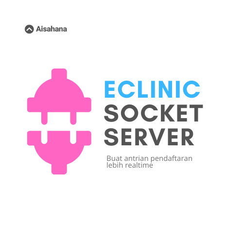

# eClinic Socket
Aplikasi socket server realtime untuk fitur antrian pendaftaran pasien.
Socket server ini digunakan bersama dengan aplikasi eClinic Frontend versi 1.2.x
dan API 1.0.x.

## Quick Setup
Clone repo ini lalu jalankan perintah:

```
# install dependencies
npm install

# serve with hot reload at localhost:3000
npm run start
```

